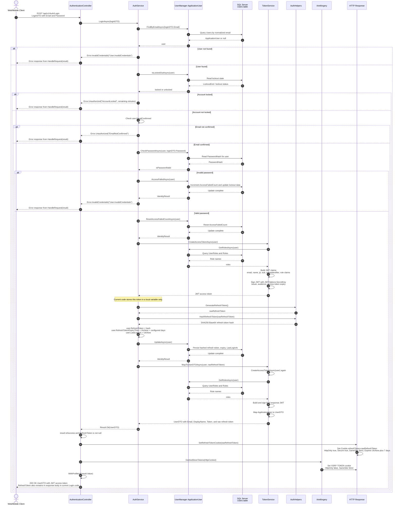
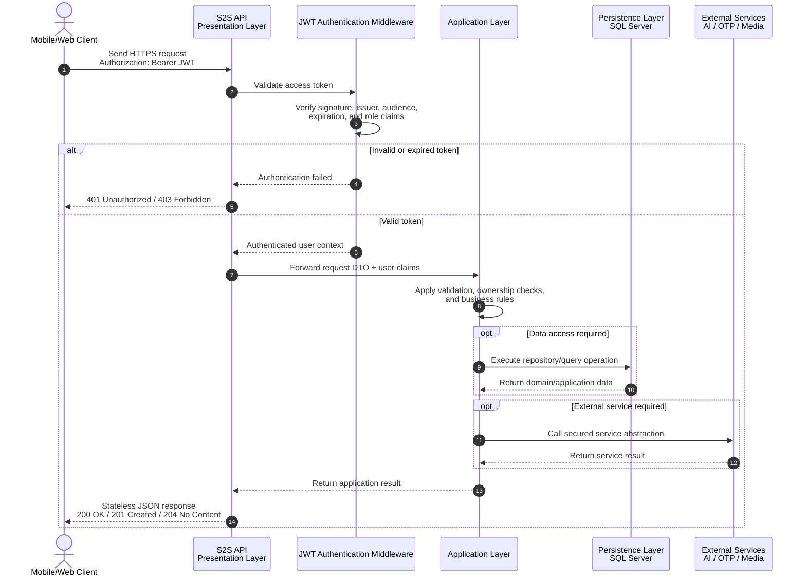

## 4. Infrastructure, Seeding, and Production Deployment

The S2S Backend API is designed with production-oriented infrastructure practices that improve reliability, security, and deployment consistency. Although the system is developed as a graduation project, the backend follows enterprise-style practices for database initialization, secret management, containerization, and runtime environment configuration.

This section explains how the API prepares its database safely, protects sensitive configuration values, and runs in a containerized production environment using Docker and Portainer Community Edition.

---

## 4.1 Infrastructure Overview

The infrastructure layer of the S2S API is responsible for connecting the application to external runtime resources such as the database, configuration providers, identity storage, and deployment environment.

The infrastructure design focuses on three major goals:

- **Safe startup**
  - The API should initialize required data without corrupting existing records or creating duplicates.

- **Secure configuration**
  - Sensitive values such as connection strings and JWT secrets must not be committed to source control.

- **Portable deployment**
  - The API should run consistently across development, testing, and production environments.

```text
+-----------------------------+
|       S2S Backend API        |
|        .NET 10 Runtime       |
+--------------+--------------+
               |
               v
+-----------------------------+
| Infrastructure Services      |
| - Database Initialization    |
| - Identity Role Seeding      |
| - Configuration Binding      |
| - JWT Options Loading        |
+--------------+--------------+
               |
       +-------+--------+
       |                |
       v                v
+-------------+   +------------------+
| SQL Server  |   | Docker Runtime   |
| Database    |   | Environment Vars |
+-------------+   +------------------+
               |
               v
+-----------------------------+
| Portainer Community Edition |
| Container Management        |
+-----------------------------+
```

---

## 4.2 Database Seeding & Initialization

Database seeding is the process of inserting required default data into the database when the application starts. In the S2S API, seeding is used to create essential Identity records such as default roles and default accounts.

The primary seeded data includes:

- `Admin` role.
- `User` role.
- Default administrator account.
- Default normal user account, if required for testing or demonstration.

This ensures that the system has the minimum required identity structure immediately after deployment.

---

### 4.2.1 Purpose of Seeding

Seeding is important because the authentication and authorization system depends on predefined roles. For example, admin endpoints protected by:

```csharp
[Authorize(Roles = "Admin")]
```

require the `Admin` role to exist in the database before any administrator can access the governance dashboard.

Without seeding, the first deployment may require manual database intervention, which is risky and inconsistent.

Database seeding provides:

- Consistent initial setup.
- Reduced manual configuration.
- Safer production deployment.
- Repeatable environment creation.
- Automatic preparation of Identity roles and accounts.

---

### 4.2.2 Using IDataInitializer with .NET 10 Keyed Services

The S2S API uses an `IDataInitializer` abstraction to organize startup seeding logic. This interface defines a consistent contract for initialization services.

Example conceptual interface:

```csharp
public interface IDataInitializer
{
    Task InitializeAsync();
}
```

Instead of placing seeding logic directly inside `Program.cs`, the application registers initialization services through dependency injection. With **.NET 10 Keyed Services**, different initialization tasks can be registered and resolved using specific keys.

Conceptual service registration:

```csharp
builder.Services.AddKeyedScoped<IDataInitializer, IdentityDataInitializer>("identity");
```

Conceptual startup execution:

```csharp
var initializer = serviceProvider
    .GetRequiredKeyedService<IDataInitializer>("identity");

await initializer.InitializeAsync();
```

This approach allows the API to separate different initialization responsibilities, such as Identity seeding, dictionary seeding, or development sample data.

```text
+------------------+
| Application      |
| Startup          |
+--------+---------+
         |
         v
+-----------------------------+
| Resolve Keyed Service       |
| IDataInitializer: identity  |
+-------------+---------------+
              |
              v
+-----------------------------+
| Identity Data Initializer   |
+-------------+---------------+
              |
              v
+-----------------------------+
| Check Existing Roles/Users  |
+-------------+---------------+
              |
        +-----+------+
        |            |
        v            v
Already Exists   Missing Data
        |            |
        v            v
 Skip Insert     Create Safely
        |            |
        +-----+------+
              |
              v
+-----------------------------+
| Startup Completes Safely    |
+-----------------------------+
```

---

### 4.2.3 Preventing Duplicates and Constraint Violations

A critical requirement of database seeding is that it must be **idempotent**. This means the seeding process can run multiple times without creating duplicate records or violating database constraints.

The initializer checks whether each role or account already exists before creating it.

Example conceptual logic:

```csharp
if (!await roleManager.RoleExistsAsync("Admin"))
{
    await roleManager.CreateAsync(new IdentityRole("Admin"));
}

if (await userManager.FindByEmailAsync(adminEmail) is null)
{
    var admin = new ApplicationUser
    {
        UserName = adminEmail,
        Email = adminEmail,
        EmailConfirmed = true
    };

    await userManager.CreateAsync(admin, adminPassword);
    await userManager.AddToRoleAsync(admin, "Admin");
}
```

This protects the database from:

- Duplicate role names.
- Duplicate user emails.
- Foreign key violations.
- Invalid role assignments.
- Startup failures after redeployment.

Technical justification:

- Role existence is checked before insertion.
- User existence is checked before account creation.
- Role assignment occurs only after the user and role are available.
- Identity managers enforce password hashing and database consistency.
- Startup seeding remains safe across repeated deployments.

---

### 4.2.4 Actual Identity Database Schema

The current persistence model is defined by `S2SIdentityDbContext`, which inherits from `IdentityDbContext<ApplicationUser>`. The database schema is primarily the ASP.NET Core Identity schema, customized with:

- `Users` instead of `AspNetUsers`.
- `Roles` instead of `AspNetRoles`.
- `UserRoles` instead of `AspNetUserRoles`.
- A separate owned-type table named `UserAddresses`.
- Application-specific tables for OTP records and password history.
- Sign-language profile fields stored directly on `Users`.

The sign language translation endpoints currently call external AI services through service abstractions and DTOs. They do not create persisted translation-history entities in the Domain layer or mapped translation tables in the Persistence layer.

```mermaid
erDiagram
    Users {
        string Id PK "nvarchar(450)"
        int AccessFailedCount "int"
        string ConcurrencyStamp "nvarchar(max), concurrency token, nullable"
        datetime CreatedAt "datetime2, required"
        date DateOfBirth "date, nullable"
        string DisplayName "nvarchar(max), required"
        string Email "nvarchar(256), nullable"
        bool EmailConfirmed "bit"
        string FcmToken "nvarchar(max), nullable"
        bool IsActive "bit, default true"
        bool IsFirstLogin "bit"
        datetime LastLoginAt "datetime2, nullable"
        bool LockoutEnabled "bit"
        datetimeoffset LockoutEnd "datetimeoffset, nullable"
        string NormalizedEmail "nvarchar(256), nullable"
        string NormalizedUserName "nvarchar(256), nullable, unique index UserNameIndex"
        string PasswordHash "nvarchar(max), nullable"
        string PhoneNumber "nvarchar(max), nullable"
        bool PhoneNumberConfirmed "bit"
        string ProfileImageUrl "nvarchar(max), nullable"
        string RefreshToken "nvarchar(max), nullable"
        datetime RefreshTokenExpiryTime "datetime2, nullable"
        string SecurityStamp "nvarchar(max), nullable"
        string SignLanguage "nvarchar(max), required, enum stored as string"
        bool TwoFactorEnabled "bit"
        datetime UpdatedAt "datetime2, nullable"
        string UserName "nvarchar(100), required"
        string UserType "Type, nvarchar(max), required, enum stored as string"
        bool UsesSignLanguage "bit"
    }

    UserAddresses {
        string UserId PK "FK to Users.Id, nvarchar(450)"
        string City "nvarchar(100), nullable"
        string Country "nvarchar(100), nullable"
        string Street "nvarchar(100), nullable"
    }

    Roles {
        string Id PK "nvarchar(450)"
        string ConcurrencyStamp "nvarchar(max), concurrency token, nullable"
        string Name "nvarchar(256), nullable"
        string NormalizedName "nvarchar(256), nullable, unique filtered index RoleNameIndex"
    }

    UserRoles {
        string UserId PK "FK to Users.Id, nvarchar(450)"
        string RoleId PK "FK to Roles.Id, nvarchar(450)"
    }

    AspNetRoleClaims {
        int Id PK "int, identity"
        string RoleId FK "nvarchar(450), required"
        string ClaimType "nvarchar(max), nullable"
        string ClaimValue "nvarchar(max), nullable"
    }

    AspNetUserClaims {
        int Id PK "int, identity"
        string UserId FK "nvarchar(450), required"
        string ClaimType "nvarchar(max), nullable"
        string ClaimValue "nvarchar(max), nullable"
    }

    AspNetUserLogins {
        string LoginProvider PK "nvarchar(450)"
        string ProviderKey PK "nvarchar(450)"
        string ProviderDisplayName "nvarchar(max), nullable"
        string UserId FK "nvarchar(450), required"
    }

    AspNetUserTokens {
        string UserId PK "FK to Users.Id, nvarchar(450)"
        string LoginProvider PK "nvarchar(450)"
        string Name PK "nvarchar(450)"
        string Value "nvarchar(max), nullable"
    }

    UserOtps {
        int Id PK "int, identity"
        string UserId FK "nvarchar(450), required"
        string OtpHash "nvarchar(max), required"
        datetime ExpiryTime "datetime2, required"
        int Attempts "int"
        bool IsUsed "bit"
        datetime CreatedAt "datetime2, required"
    }

    UserPasswordHistories {
        int Id PK "int, identity"
        string UserId FK "nvarchar(450), required"
        string PasswordHash "nvarchar(max), required"
        datetime CreatedAt "datetime2, required"
    }

    Users ||--o| UserAddresses : "owns address"
    Users ||--o{ UserOtps : "has OTP records"
    Users ||--o{ UserPasswordHistories : "has password history"
    Users ||--o{ AspNetUserClaims : "has claims"
    Users ||--o{ AspNetUserLogins : "has external logins"
    Users ||--o{ AspNetUserTokens : "has identity tokens"
    Users ||--o{ UserRoles : "assigned roles"
    Roles ||--o{ UserRoles : "contains users"
    Roles ||--o{ AspNetRoleClaims : "has claims"
```



Relationship details:

- `Users` to `UserAddresses` is one-to-zero-or-one. `UserAddresses.UserId` is both the primary key and foreign key to `Users.Id`.
- `Users` to `UserOtps` is one-to-many. `UserOtps.UserId` references `Users.Id`.
- `Users` to `UserPasswordHistories` is one-to-many. `UserPasswordHistories.UserId` references `Users.Id`.
- `Users` to `Roles` is many-to-many through `UserRoles`, whose composite primary key is `(UserId, RoleId)`.
- `Users` to `AspNetUserTokens` is one-to-many with a composite token primary key of `(UserId, LoginProvider, Name)`.
- `Users` to `AspNetUserLogins` is one-to-many with a composite login primary key of `(LoginProvider, ProviderKey)`.
- `Roles` to `AspNetRoleClaims` is one-to-many.
- Identity relationships are configured with cascade delete by the Identity model snapshot.

---

### 4.2.5 Seeding Responsibility Design

The initializer is kept separate from controllers and business use cases because seeding is an infrastructure concern. It should run during application startup, not during normal user requests.

This separation provides:

- Cleaner `Program.cs` startup configuration.
- Better testability of initialization logic.
- Easier addition of future seeders.
- Reduced coupling between infrastructure and presentation layers.
- Clear ownership of database initialization tasks.

```text
+---------------------+
| Program.cs          |
| Startup Pipeline    |
+----------+----------+
           |
           | Calls
           v
+---------------------+
| IDataInitializer    |
| Abstraction         |
+----------+----------+
           |
           | Implemented By
           v
+---------------------+
| Identity Seeder     |
| Infrastructure      |
+----------+----------+
           |
           | Uses
           v
+---------------------+
| UserManager         |
| RoleManager         |
| SQL Server          |
+---------------------+
```

---

## 4.3 Production Secrets Management

Production systems must protect sensitive configuration values. In the S2S API, secrets are strictly kept out of `appsettings.json` and injected at runtime through environment variables.

Sensitive values include:

- Database connection strings.
- JWT signing keys.
- JWT issuer.
- JWT audience.
- Token expiration settings.
- Default admin credentials.
- Email or OTP provider credentials.

The purpose of this practice is to prevent accidental exposure of production secrets through source control, screenshots, shared archives, or public repositories.

---

### 4.3.1 Why Secrets Are Not Stored in appsettings.json

The `appsettings.json` file is useful for non-sensitive configuration, but it should not contain production secrets.

Unsafe values in `appsettings.json` may cause:

- Credential leakage through Git.
- Unauthorized database access.
- JWT token forgery if signing keys are exposed.
- Difficulty rotating secrets.
- Environment-specific configuration conflicts.

Instead, production secrets are supplied by the hosting environment.

```text
+----------------------+
| appsettings.json     |
| Non-sensitive Config |
+----------+-----------+
           |
           v
+----------------------+
| Environment Variables|
| Sensitive Runtime    |
| Values               |
+----------+-----------+
           |
           v
+----------------------+
| .NET Configuration   |
| Provider             |
+----------+-----------+
           |
           v
+----------------------+
| Strongly Typed       |
| Options Binding      |
+----------------------+
```

---

### 4.3.2 Docker and Portainer Environment Variables

In production deployment, sensitive configuration is injected through Docker or Portainer environment variables. Portainer Community Edition provides a visual interface for defining container environment variables without modifying the application source code.

For nested JSON configuration keys, .NET supports the double underscore convention:

```text
Parent__Child__Property
```

This maps environment variables to nested configuration sections.

For example, the following JSON structure:

```json
{
  "Jwt": {
    "Issuer": "S2S",
    "Audience": "S2SClients",
    "SigningKey": "SECRET_VALUE"
  }
}
```

Can be provided through environment variables as:

```text
Jwt__Issuer=S2S
Jwt__Audience=S2SClients
Jwt__SigningKey=SECRET_VALUE
```

Connection strings can also be injected as environment variables:

```text
ConnectionStrings__DefaultConnection=Server=sqlserver;Database=S2S;User Id=sa;Password=StrongPassword;
```

---

### 4.3.3 Example Production Environment Variables

| Environment Variable | Purpose |
|---|---|
| `ConnectionStrings__DefaultConnection` | Provides the SQL Server database connection string. |
| `Jwt__Issuer` | Defines the trusted JWT issuer. |
| `Jwt__Audience` | Defines the intended JWT audience. |
| `Jwt__SigningKey` | Provides the secret key used to sign JWT tokens. |
| `Jwt__AccessTokenExpirationMinutes` | Defines access token lifetime. |
| `Jwt__RefreshTokenExpirationDays` | Defines refresh token lifetime. |
| `SeedAdmin__Email` | Provides the default admin email during seeding. |
| `SeedAdmin__Password` | Provides the default admin password during seeding. |

Technical justification:

- Keeps secrets outside source control.
- Allows different values for development and production.
- Supports secret rotation without rebuilding the application image.
- Integrates naturally with Docker and Portainer.
- Uses the standard .NET configuration provider pipeline.

---

### 4.3.4 Runtime Configuration Binding

At startup, the .NET configuration system reads values from multiple providers. Environment variables override values from `appsettings.json`, which allows production settings to be injected securely.

Conceptual options binding:

```csharp
builder.Services.Configure<JwtOptions>(
    builder.Configuration.GetSection("Jwt"));
```

When the container starts, the API reads the injected values and binds them to strongly typed options classes.

```text
+-----------------------------+
| Docker / Portainer Env Vars |
+--------------+--------------+
               |
               v
+-----------------------------+
| .NET Configuration Provider |
+--------------+--------------+
               |
               v
+-----------------------------+
| JwtOptions / Connection     |
| String Binding              |
+--------------+--------------+
               |
               v
+-----------------------------+
| Authentication + Database   |
| Services                    |
+-----------------------------+
```

This approach creates a secure boundary between source code and deployment-specific secrets.

---

## 4.4 Containerization & Orchestration

The S2S API is containerized using Docker to ensure deployment consistency across environments. Containerization packages the API, runtime dependencies, and configuration expectations into a repeatable unit that can run on any Docker-compatible host.

Portainer Community Edition is used to simplify container management through a visual dashboard.

---

### 4.4.1 Docker Containerization

Docker allows the .NET 10 API to run in an isolated container. The container includes the compiled application and runs it using the .NET runtime image.

A typical production containerization flow is:

```text
+---------------------+
| Source Code         |
+----------+----------+
           |
           v
+---------------------+
| dotnet publish      |
+----------+----------+
           |
           v
+---------------------+
| Docker Image Build  |
+----------+----------+
           |
           v
+---------------------+
| Docker Container    |
| Running S2S API     |
+----------+----------+
           |
           v
+---------------------+
| Exposed API Port    |
+---------------------+
```

Docker provides:

- Consistent runtime behavior.
- Isolated application execution.
- Easier deployment to servers.
- Repeatable builds.
- Simplified dependency management.
- Clear separation between application image and runtime configuration.

---

### 4.4.2 Conceptual Dockerfile Structure

A production Dockerfile commonly uses multi-stage builds. The build stage compiles the application, while the runtime stage contains only the files required to run the API.

```dockerfile
FROM mcr.microsoft.com/dotnet/sdk:10.0 AS build
WORKDIR /src

COPY . .
RUN dotnet restore
RUN dotnet publish -c Release -o /app/publish

FROM mcr.microsoft.com/dotnet/aspnet:10.0 AS runtime
WORKDIR /app

COPY --from=build /app/publish .

ENTRYPOINT ["dotnet", "S2S.Api.dll"]
```

Technical justification:

- The SDK image is used only for building.
- The runtime image is smaller and safer for production.
- Published output is separated from source code.
- The same image can be deployed consistently across environments.

---

### 4.4.3 Portainer Community Edition

**Portainer Community Edition** is used as a visual management layer for Docker containers. It allows the project team to manage containers, environment variables, logs, images, networks, and volumes through a web interface.

Portainer supports:

- Creating containers from images.
- Managing environment variables.
- Viewing container logs.
- Restarting containers.
- Monitoring container status.
- Managing Docker networks.
- Managing persistent volumes.
- Inspecting runtime configuration.

```text
+-----------------------------+
| Portainer Community Edition |
| Visual Management Dashboard |
+--------------+--------------+
               |
               v
+-----------------------------+
| Docker Host                 |
+--------------+--------------+
               |
      +--------+---------+
      |                  |
      v                  v
+-------------+    +-------------+
| S2S API     |    | SQL Server  |
| Container   |    | Container   |
+-------------+    +-------------+
```

Technical justification:

- Provides easier production monitoring.
- Reduces reliance on manual command-line container management.
- Allows environment variables to be configured visually.
- Helps inspect logs during debugging.
- Makes deployment understandable for project demonstration and evaluation.

---

### 4.4.4 Deployment Pipeline

The production deployment process follows a simple and repeatable pipeline.

```text
+----------------------+
| 1. Build Application |
+----------+-----------+
           |
           v
+----------------------+
| 2. Build Docker Image|
+----------+-----------+
           |
           v
+----------------------+
| 3. Push / Transfer   |
| Image to Server      |
+----------+-----------+
           |
           v
+----------------------+
| 4. Configure Env Vars|
| in Portainer         |
+----------+-----------+
           |
           v
+----------------------+
| 5. Start Container   |
+----------+-----------+
           |
           v
+----------------------+
| 6. Run Initializers  |
| Roles + Accounts     |
+----------+-----------+
           |
           v
+----------------------+
| 7. Monitor Logs and  |
| Health               |
+----------------------+
```

The deployment process includes:

- Building the .NET 10 API in Release mode.
- Creating a Docker image.
- Running the image as a Docker container.
- Injecting production secrets through Portainer environment variables.
- Connecting the API container to the SQL Server database.
- Running database initialization on startup.
- Monitoring logs and container health through Portainer.

---

## 4.5 Production Deployment Architecture

The following diagram summarizes the production deployment structure of the S2S API.

```text
+----------------------------------------------------+
|                 Production Server                  |
|                                                    |
|  +----------------------------------------------+  |
|  |        Portainer Community Edition            |  |
|  |  - Container Management                       |  |
|  |  - Environment Variables                      |  |
|  |  - Logs and Monitoring                        |  |
|  +----------------------+-----------------------+  |
|                         |                          |
|                         v                          |
|  +----------------------------------------------+  |
|  |              Docker Runtime                   |  |
|  |                                              |  |
|  |  +-------------------+   +----------------+  |  |
|  |  | S2S API Container |   | SQL Server     |  |  |
|  |  | .NET 10 Backend   |-->| Database       |  |  |
|  |  +---------+---------+   +----------------+  |  |
|  |            |                                 |  |
|  |            v                                 |  |
|  |  +-------------------+                       |  |
|  |  | Runtime Env Vars  |                       |  |
|  |  | JWT / Connection  |                       |  |
|  |  | Strings / Seeds   |                       |  |
|  |  +-------------------+                       |  |
|  +----------------------------------------------+  |
|                                                    |
+----------------------------------------------------+
```

---

## 4.6 Infrastructure Summary

The infrastructure and deployment strategy of the S2S API follows enterprise-oriented practices suitable for secure backend systems.

| Practice | Purpose |
|---|---|
| `IDataInitializer` | Provides a structured contract for startup database initialization. |
| .NET 10 Keyed Services | Allows different initializers to be registered and resolved safely by key. |
| Identity Role Seeding | Ensures required roles such as `Admin` and `User` exist. |
| Default Account Seeding | Creates required startup accounts without manual database intervention. |
| Idempotent Checks | Prevents duplicate records and database constraint violations. |
| Environment Variables | Keeps sensitive production data outside source control. |
| Double Underscore Convention | Maps environment variables to nested .NET configuration keys. |
| Docker | Packages the API into a portable runtime container. |
| Portainer Community Edition | Provides visual container management, monitoring, and configuration. |

Through these practices, the S2S Backend API becomes easier to deploy, safer to configure, and more reliable during production startup. The system can initialize required data automatically, protect sensitive values from exposure, and run consistently in containerized environments.

---

## 5. System Integration & Getting Started

This final section explains how a developer can prepare the S2S Backend API locally and understand the secure request flow between client applications, the API, and the underlying data and service layers. The goal is to provide a concise onboarding path that allows new contributors to run the system consistently while respecting the same architectural and security principles used in production.

---

## 5.1 Developer Onboarding

The S2S API is organized as a multi-project .NET solution. The main executable API project is `Sehety.Web`, while persistence concerns, domain models, shared contracts, and service implementations are separated into their own projects.

### 5.1.1 Clone the Repository

The first step is to clone the repository and move into the project directory.

```bash
git clone <repository-url>
cd S2S
```

After cloning, restore the required .NET packages:

```bash
dotnet restore S2S.slnx
```

Technical justification:

- Restoring the solution ensures all project dependencies are downloaded before build or migration commands are executed.
- Using the solution file keeps all projects synchronized during restore.
- The same repository structure can be used by backend, AI integration, and frontend collaborators.

---

### 5.1.2 Configure Local Settings

For local development, the API requires a valid SQL Server connection string and JWT configuration. These values should be configured through development-safe configuration methods such as local user secrets, environment variables, or a local-only settings file excluded from source control.

Recommended local configuration keys include:

| Key | Purpose |
|---|---|
| `ConnectionStrings:DefaultConnection` | SQL Server connection string used by Entity Framework Core. |
| `JWTOptions:SecretKey` | Secret key used to sign JWT access tokens. |
| `JWTOptions:Issuer` | Trusted JWT issuer. |
| `JWTOptions:Audience` | Intended JWT audience. |
| `JWTOptions:AccessTokenExpiryInMinutes` | Access token expiration time. |
| `JWTOptions:RefreshTokenExpiryInDays` | Refresh token expiration time. |

Example using environment variables with the .NET double underscore convention:

```bash
ConnectionStrings__DefaultConnection="Server=localhost;Database=S2SDB;Trusted_Connection=True;TrustServerCertificate=True"
JWTOptions__SecretKey="LOCAL_DEVELOPMENT_SECRET_KEY"
JWTOptions__Issuer="https://localhost:7252"
JWTOptions__Audience="https://localhost:7252"
```

Technical justification:

- Local settings allow each developer to use their own database instance.
- Sensitive values remain outside committed source files.
- The same configuration model works in local, Docker, and production environments.
- The double underscore convention maps environment variables to nested .NET configuration keys.

---

### 5.1.3 Apply Entity Framework Core Migrations

Before running the API, the SQL Server database must match the current Entity Framework Core model. The project stores Identity-related migrations inside the persistence layer.

Using Visual Studio Package Manager Console:

```powershell
Update-Database
```

If the startup and migration projects need to be specified explicitly:

```powershell
Update-Database -StartupProject Sehety.Web -Project Sehety.Persistence
```

Equivalent .NET CLI command:

```bash
dotnet ef database update --startup-project Sehety.Web --project Sehety.Persistence
```

Technical justification:

- EF Core migrations create or update the SQL Server schema in a controlled manner.
- The persistence project owns database migration files.
- The startup project provides runtime configuration and dependency injection.
- Applying migrations before running the API prevents runtime database schema errors.

---

### 5.1.4 Run the API

After configuration and database migration, the API can be launched from the startup project.

```bash
dotnet run --project Sehety.Web
```

When the application starts, the backend loads configuration, connects to SQL Server, configures authentication and authorization, applies startup initialization logic, and exposes the API endpoints.

Typical local startup flow:

```text
+-------------------------+
| Developer Starts API    |
+-----------+-------------+
            |
            v
+-------------------------+
| Load Configuration      |
| appsettings + env vars  |
+-----------+-------------+
            |
            v
+-------------------------+
| Configure Services      |
| DbContext / Identity    |
| JWT / Rate Limiting     |
+-----------+-------------+
            |
            v
+-------------------------+
| Connect to SQL Server   |
+-----------+-------------+
            |
            v
+-------------------------+
| Run Data Initializers   |
| Roles + Default Users   |
+-----------+-------------+
            |
            v
+-------------------------+
| API Ready for Requests  |
+-------------------------+
```

Technical justification:

- Running through `Sehety.Web` ensures the complete API pipeline is loaded.
- Startup initialization prepares required Identity data.
- Middleware such as authentication, authorization, rate limiting, and anti-forgery protection becomes active.
- The backend becomes ready to serve both mobile and web clients through the same API surface.

---

## 5.2 API Request Flow Diagram

The following Mermaid.js sequence diagram illustrates a secure stateless request flow. The flow begins when a mobile or web client sends an authenticated request and ends when the API returns a clean JSON response without storing per-request session state on the server.

### 5.2.1 Login Endpoint Sequence

The following Mermaid.js sequence diagram shows the actual login flow implemented by `AuthenticationController.Login` and `AuthService.LoginAsync`. The public route is `POST /api/v{version}/Auth/Login`.



Important implementation notes:

- The plaintext refresh token is generated with `RandomNumberGenerator`, returned to the controller, and stored in the browser as the `refreshToken` cookie.
- The database stores only `HashRefreshToken(rawRefreshToken)`, not the plaintext refresh token.
- The refresh-token cookie is configured as `HttpOnly`, `Secure`, `SameSite.Strict`, and expires after seven days in the controller helper.
- The login endpoint also calls `IAntiforgery.GetAndStoreTokens`, which creates the JavaScript-readable `XSRF-TOKEN` cookie used by later web cookie-based requests.
- Unlike `VerifyEmail`, the current `Login` action does not remove `RefreshToken` from the returned `UserDTO`, so mobile clients can read it from the response body while web clients also receive it as an HttpOnly cookie.

---



---

## 5.3 Integration Summary

The S2S API integrates client applications, authentication services, database persistence, and AI-related services through a secure and maintainable backend pipeline.

| Integration Point | Responsibility |
|---|---|
| Mobile/Web Clients | Send authenticated HTTPS requests and consume JSON responses. |
| JWT Middleware | Validates identity, token integrity, expiration, and role claims. |
| Presentation Layer | Receives requests, applies API-level policies, and returns HTTP responses. |
| Application Layer | Coordinates use cases, validation, ownership checks, and business rules. |
| Persistence Layer | Executes database operations through Entity Framework Core and SQL Server. |
| Services Layer | Communicates with external capabilities such as AI translation, OTP, media, and notification services. |

This integration model preserves the main architectural principle of the project: clients communicate with a secure API boundary, while business logic remains isolated from infrastructure details. As a result, the S2S Backend API remains testable, maintainable, and ready for extension as the platform evolves.
